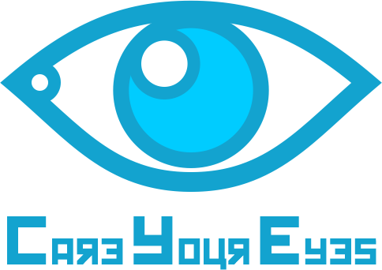
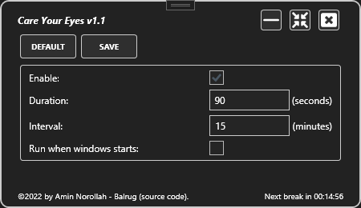
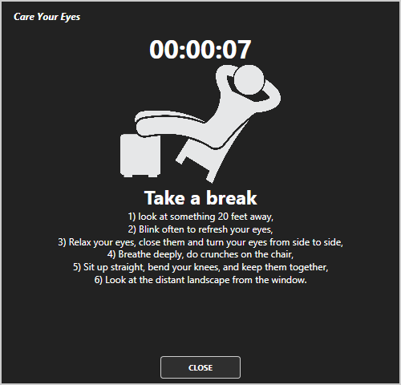

  

    </img>
    </img>
    </img>
    <a href="https://github.com/amin-norollah/CareYourEyes/actions?query=workflow%3Abuild">
        </img>
    </a>

## About this project
Protect your eyes from tiredness and overwork. I developed this application to remind you that you supposed to rest at regular intervals.

In the past, I used other applications, which unfortunately are no longer free to use. Therefore, I decided to provide a free application. The features of this software are limited. If you have any suggestions for improving it, please contact me:

Please go to [my webpage](http://norollah.com) to contact me.

        
     

## Download

You can download the latest version of CareYourEyes application from link below:

<a href="https://github.com/amin-norollah/CareYourEyes/blob/master/Download/CareYourEyes.exe">
      Click here to start download
</a>

<a href="http://norollah.com/#/care-your-eyes">
      Official web page of Care Your Eyes
</a>

